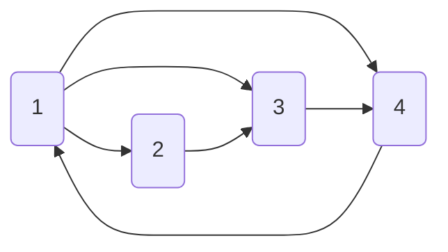
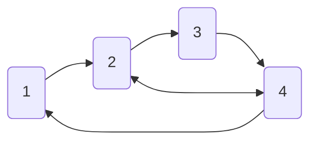

# Lab Assignment 4

## Graphs as a Data Structure

Use linked-list concepts to implement graphs.
A graph is a collection of nodes in which each node can have several neighboring nodes.

An example graph is provided [here](../../../en/09_generic_data_structures/graph.cpp).

1. Define the structure of a graph node. 
   It should have an `int` field for the node's value and a dynamic buffer for its neighboring nodes.
   You can use code from [static_buffer](../../../en/09_generic_data_structures/static_buffer.cpp)
   or [dynamic_array](../../../en/09_generic_data_structures/dynamic_array.cpp).
   > You can use `std::vector`, but then make sure you understand RAII. 

2. Implement one of the following graph configurations:

3. In directed graphs, node `A` can be a neighbor of node `B`,
   while node `B` is not necessarily a neighbor of node `A`.
   In undirected graphs, nodes `A` and `B` are always neighbors of each other.
   Explain how this idea is reflected in the graph's memory layout.

4. Write a function that calculates the sum of the values of a given node's neighbors.

5. Implement the DFS and BFS traversal algorithms. You can add additional information to the nodes themselves.
