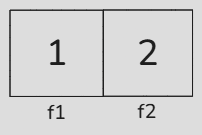

# Structures

- [In-depth video on basic syntax, section on structures](https://www.youtube.com/watch?v=9AhNOjjyAwU&list=PL4sUOB8DjVlWUcSaCu0xPcK7rYeRwGpl7&index=8&t=2457)
- [Video on programming techniques that explains how structures work](https://www.youtube.com/watch?v=6JtlzvwhHr0&list=PL4sUOB8DjVlWUcSaCu0xPcK7rYeRwGpl7&index=29)

## Concepts

- User-defined data types
- A structure for grouping related variables
- A structure as an abstraction (a computer lab consists of desks and computers)
- Field
- Structure initialization
- Pointer to a structure
- Field offset
- The `->` operator

## Examples for understanding

Analyze what happens in the examples:

### 1. Structure initialization
```cpp
#include <iostream>

struct A
{
    int f1;
    int f2;
};

int main()
{
    A a { 1, 2 };
    std::cout << a.f1 << std::endl;
    std::cout << a.f2 << std::endl;
}
```

<details>
<summary>Answer:</summary>

By default, brace initialization syntax can be used for any structure.
It assigns values to the fields one by one, in the order in which they are declared.

It prints `1` and `2`.
</details>

### 2. An expression of a structure type
```cpp
#include <iostream>

struct A
{
    int f1;
    int f2;
};

int main()
{
    A a = A{ 1, 2 };
    std::cout << a.f1 << std::endl;
    std::cout << a.f2 << std::endl;
}
```

<details>
<summary>Answer:</summary>

The same thing happens as in the previous example.
</details>

<details>
<summary>What is the type of the expression <code>A{ 1, 2 }</code>?</summary>

The type of a variable does not have to be an integer type (`int`, `uint8_t`);
it can also be user-defined.

In this example, `A` is a user-defined data type.

`A{ 1, 2 }` is an expression of type `A`.
More precisely, the static (known at compile time) type of the value
obtained by evaluating the expression `A{ 1, 2 }` is `A`.

<details>
<summary>How can a type be something other than <code>int</code>?</summary>

You can think of such an expression as a piece of memory with two fields, `f1` and `f2`,
whose values are `1` and `2`, as in the image below.
Think of it as temporary data simply suspended in the air; it is not stored
anywhere in RAM.


</details>

The fact that the expression has type `A` means that
the result of evaluating it can be stored in a variable of type `A`.
Now this “suspended” value is placed in variable `a`.
It can be placed there because `a` has type `A`,
which is compatible with the type of expression `A{ 1, 2 }` (also type `A`).
</details>

### 3. Assigning a structure to an `int`
```cpp
#include <iostream>

struct A
{
    int f1;
    int f2;
};

int main()
{
    int a = A{ 1, 2 };
    std::cout << a << std::endl;
}
```

<details>
<summary>Answer:</summary>

It will not compile because the expression `A{ 1, 2 }` has type `A`, while `a` has type `int`.
A value of type `A` cannot be stored in a variable of type `int`.
</details>

### 4. Operations with fields
```cpp
#include <iostream>

struct A
{
    int f1;
    int f2;
};

int main()
{
    A a;
    a.f1 = 5;
    int b = a.f1;
    a.f2 = b;
 
    std::cout << a.f1 << std::endl;
    std::cout << a.f2 << std::endl;
    std::cout << b << std::endl;
}
```

<details>
<summary>Answer:</summary>

You can read from and write to each field individually.

It prints `5` three times.
</details>

### 5. Field addresses
```cpp
#include <iostream>

struct A
{
    int f;
};

int main()
{
    A a;
    int* b = &a.f;
    *b = 5;
    std::cout << a.f << std::endl;
}
```

<details>
<summary>Answer:</summary>

You can obtain the address of a field inside a variable of a structure type.

In the line `int* b = &a.f`, the dot in `&a.f` is evaluated first,
giving access to field `f` inside `a`; its address is then obtained using `&`.

Value `5` is stored in `a.f`.
</details>

### 6. Assigning a structure variable (1)
```cpp
#include <iostream>

struct A
{
    int f1;
    int f2;
};

int main()
{
    A a;
    a.f1 = 5;
    a.f2 = 6;

    A b;
    b = a;

    std::cout << a.f1 << std::endl;
    std::cout << a.f2 << std::endl;

    std::cout << b.f1 << std::endl;
    std::cout << b.f2 << std::endl;
}
```

<details>
<summary>Answer:</summary>

`b = a` copies the values of *all fields* of `a` into `b`.
</details>

### 7. Assigning a structure variable (2)
```cpp
#include <iostream>

struct A
{
    int f1;
    int f2;
};

int main()
{
    A a;
    a.f1 = 5;
    a.f2 = 6;

    A b;
    b.f1 = 7;
    b = a;

    std::cout << a.f1 << std::endl;
    std::cout << a.f2 << std::endl;

    std::cout << b.f1 << std::endl;
    std::cout << b.f2 << std::endl;
}
```

<details>
<summary>Answer:</summary>

`b = a` does not know which fields have already been initialized.
It copies *all* fields indiscriminately.

In the end, `b` has `f1 = 5`, `f2 = 6`.
</details>

### 8. Structure address (1)
```cpp
#include <iostream>

struct A
{
    int f1;
    int f2;
};

int main()
{
    A a;
    a.f1 = 5;
    a.f2 = 6;
    A* pa = &a;
    A b = *pa;

    std::cout << b.f1 << std::endl;
    std::cout << b.f2 << std::endl;
}
```
<details>
<summary>Answer:</summary>

In the initialization of `b`, `*pa` is essentially equivalent to directly accessing `a`. This is the same situation as above.
</details>

### 9. Structure address (1)
```cpp
#include <iostream>

struct A
{
    int f1;
    int f2;
};

int main()
{
    A a;
    a.f1 = 5;
    a.f2 = 6;
    A* pa = &a;
    a.f1 = 7;
    A b = *pa;

    std::cout << b.f1 << std::endl;
    std::cout << b.f2 << std::endl;
}
```
<details>
<summary>Answer:</summary>

`b.f1` receives `7`.
The `&` operator does not take the address of the values `f1 = 5, f2 = 6`;
it takes the address of variable `a`.
When dereferencing that address, you always get the current value of `a`.
</details>

### 10. The `->` operator
```cpp
#include <iostream>

struct A
{
    int f1;
    int f2;
};

int main()
{
    A a;
    a.f1 = 5;
    A* pa = &a;
    (*pa).f2 = 6;
    pa->f1 = 7;

    std::cout << a.f1 << std::endl;
    std::cout << a.f2 << std::endl;
}
```
<details>
<summary>Answer:</summary>

`*pa` is essentially equivalent to directly accessing `a`.

`(*pa).f2 = 6` -> `a.f2 = 6`.

`pa->f1` means “go to the variable at the address in `pa`, then access field `f1`.”
This can also be written as `(*pa).f1`.
In practice, it is equivalent to `a.f1`.
</details>

### 11. Overwriting through an address
```cpp
#include <iostream>

struct A
{
    int f1;
    int f2;
};

int main()
{
    A a{};
    A* pa { &a };
    *pa = { 5, 6 };
    std::cout << pa->f1 << std::endl;
    std::cout << pa->f2 << std::endl;
}
```

<details>
<summary>Answer</summary>

`*fp = { 5, 6 }` -> `*(&a) = { 5, 6 }` -> `a = { 5, 6 }`

This means `a.f1 = 5`, `a.f2 = 6`.

`fp->f1` reads what is currently in `a`. Since `5` was written there earlier, it prints `5`.

Similarly, `fp->f2` prints `6`.
</details>

### 12. Address of a structure type
```cpp
#include <iostream>

struct A
{
    int f1;
    int f2;
};

int main()
{
    A* fp { &A };
    *fp = { 5, 6 };
    std::cout << fp->f1 << std::endl;
}
```

<details>
<summary>Answer:</summary>

This is not allowed because structure `A` itself stores no data.
Data can be stored in a *variable of type `A`*, which must be created first.
</details>

### 13. Address of a type field
```cpp
#include <iostream>

struct A
{
    int f1;
    int f2;
};

int main()
{
    int* fp { &A.f1 };
    *fp = 5;
    std::cout << *fp << std::endl;
}
```

<details>
<summary>Answer:</summary>

This is not allowed. The explanation is the same as in the previous example.
</details>

### 14. An address field
```cpp
#include <iostream>

struct A
{
    int* f1;
};

int main()
{
    int num = 1;
    A a;
    a.f1 = &num;
    *a.f1 = 2;

    std::cout << a.f1 << std::endl;
    std::cout << num << std::endl;
}
```
<details>
<summary>Answer:</summary>

In `*a.f1`, `*` is applied *after* `.`, that is:
`*a.f1` -> `*(&num)` -> `num`.
After that, `num` is overwritten with `2`.

It prints the address of `num`, then `2`.
</details>

### 15. An array field of addresses
```cpp
#include <iostream>

struct A
{
    int* f[2];
};

int main()
{
    int var1;
    int var2;
    A a { .f = { &var1, &var2 } };
    *a.f[0] = 1;
    *a.f[1] = 2;
    int** b = a.f;
    int c = **b;

    std::cout << var1 << std::endl;
    std::cout << var2 << std::endl;

    std::cout << a.f[0] << std::endl;
    std::cout << a.f[1] << std::endl;

    std::cout << b << std::endl;
    std::cout << c << std::endl;
}
```

<details>
<summary>Answer:</summary>

The line `A a { .f = { &var1, &var2 } };` initializes `a`,
putting the address of `var1` into field `a.f[0]` and the address of `var2` into `a.f[1]`.

In the line `*a.f[0] = ...`, execution follows the address stored in `a.f[0]`:
`*a.f[0]` -> `*(a.f[0])` -> `*(&var1)` -> `var1`.

In `int** b = a.f;`, `a.f` is equivalent to `&(a.f[0])`.
This gives the address of the first element in array `f` in `a`.

It prints:
- `1`, `2` as the values of `var1` and `var2`;
- the addresses of `var1` and `var2` as the values of `a.f[0]` and `a.f[1]`;
- `c` is equal to `1`.

</details>

### 16. A nested structure
```cpp
#include <iostream>

struct Nested
{
    int f;
};

struct A
{
    Nested nested;
    int f;
};

int main()
{
    A a {
       .nested = { .f = 1 },
       .f = 2,
    };

    a.f = 3;
    a.nested = { 5 };
    a.nested.f = 6;

    std::cout << a.f << std::endl;
    std::cout << a.nested.f << std::endl;
}
```

<details>
<summary>Answer:</summary>

Other structures can be nested inside a structure.
This is called nesting, and it is used constantly in programming.

Here, in the end, `a.f` equals `3`, and `a.nested.f` equals `6`.
</details>

### 17. Why will this code not compile?

```cpp
struct A
{
    int value;
    A other;
};
```

<details>
<summary>Answer:</summary>

A structure cannot contain itself because it would then occupy
an infinite amount of memory. It is possible to include a pointer to another such structure,
because its size does not depend on the size of the structure.
</details>

### 18. Linked list
```cpp
#include <iostream>

struct Node
{
    int value;
    Node* next;
};

int main()
{
    Node end{};
    end.value = 1;
    end.next = nullptr;

    Node start{};
    start.value = 2;
    start.next = &end;

    Node* current = &start;
    std::cout << current->value << std::endl;

    current = current->next;
    std::cout << current->value << std::endl;

    current = current->next;
    std::cout << current->value << std::endl;
}
```
<details>
<summary>Answer:</summary>

This creates a linked list, a data structure used very often in programming.

Each node holds a pointer to another node of the same type.

The null pointer in the last node of the list (`nullptr`) marks the end of the list.

The code prints `2`, then `1`, and then crashes on the last line when it dereferences a null pointer (segmentation fault).
</details>

### 19. Structure size (1)
```cpp
#include <iostream>

struct A
{
    int f1;
    int f2;
};

int main()
{
    A a;
    std::cout << sizeof(a) << std::endl;
    std::cout << sizeof(A) << std::endl;
}
```
<details>
<summary>Answer:</summary>

`sizeof(a)` gives the size of a variable in bytes.
`sizeof(A)` gives the size in bytes of a variable of type `A`, if one were created.
Both forms are equivalent.

The result is 8 because each structure has 2 `int`s, each of which occupies 4 bytes.
</details>

### 20. Structure size (2)
```cpp
#include <iostream>

struct A
{
    int f1[4];
    int* f2;
};

int main()
{
    std::cout << sizeof(A) << std::endl;
}
```

<details>
<summary>Answer:</summary>

- `int f1[4]` is 4 `int`s, 4 bytes each — 16 bytes;
- `int* f2` is 8 bytes on a 64-bit processor.

The total is 24 bytes.
</details>

### 21. Field address from a structure address
```cpp
#include <iostream>

struct A
{
    int f;
};

int main()
{
    A a { 1 };
    A* pa { &a };
    int* pf { &pa->f };
    *pf = 2;
    std::cout << a.f << std::endl;
}
```

<details>
<summary>Answer:</summary>

This demonstrates that you can take the address of a field after applying `->`.
`&` is applied after `->`, just as it is after `.`.

`&pa->f` -> `&(pa->f)` -> `&((*pa).f)` -> `&(a.f)`

It prints `2`.
</details>

### 22. Field address relative to a structure address
```cpp
#include <iostream>

struct A
{
    int f;
};

int main()
{
    A a { };
    A* pa { &a };
    int* pf { &pa->f };
    ptrdiff_t diff { reinterpret_cast<uint8_t*>(pf) - reinterpret_cast<uint8_t*>(pa) };
    std::cout << diff << std::endl;
}
```

<details>
<summary>Answer:</summary>

It prints `0`.

The first field of a structure and the structure itself are always located at the same memory address.
</details>

### 23. (advanced level): Structure size (3)
```cpp
#include <iostream>

struct A
{
    uint8_t f1;
    int f2;
    uint8_t f3;
};

int main()
{
    std::cout << sizeof(A) << std::endl;
}
```

<details>
<summary>Answer:</summary>

This is where alignment comes into play.
Alignment leaves empty spaces between fields.
This is done because it allows the processor to read data from memory faster.

First, the largest field size is determined; it is usually no more than 16 bytes.
In this example, it is `int` — 4 bytes.

Now divide memory into 4-byte slots.
If the next field does not fit entirely into the remaining space in a 4-byte slot,
it goes into the next one.

- `uint8_t f1` goes into the first byte of the first slot;
- `int f2` does not fit in the first slot after `f1`, so it goes into the next one.
 The remaining 3 bytes of the first slot are unused (padding bytes);
- `uint8_t f3` goes into the third slot;
- The remaining 3 bytes of the third slot are unused.

In total, this gives 3 slots of 4 bytes each.

If a structure contains a field of another structure type, its slot is no smaller than the slots of that nested structure.

Alignment can be disabled using `#pragma pack`.
</details>

### 24. (advanced level): Structure size (4)
```cpp
#include <iostream>

struct A
{
};

int main()
{
    std::cout << sizeof(A) << std::endl;
}
```

<details>
<summary>Answer:</summary>

It prints `1`.

According to the C++ standard, the size of an object cannot be less than 1,
so that 2 objects of this type can be distinguished from each other.
The reason is that 2 objects cannot have the same memory address.

Objects are covered in the next lab.
</details>

### 25. (advanced level): Field offsets
```cpp
#include <iostream>

struct A
{
    int a;
    int b;
};

int main()
{
    std::cout << offsetof(A, a) << std::endl;
    std::cout << offsetof(A, b) << std::endl;
}
```

<details>
<summary>Answer:</summary>

`offsetof` is evaluated at compile time and gives the byte offset of a specified field from the beginning of a structure.

It prints `0` for `a` and `4` for `b`.
</details>

### 26. Initializing an array field
```cpp
#include <iostream>

struct A
{
    int arr[2];
};

int main()
{
    A a { { 1, 2 } };
    A b { { 3, 4 } };
    b = a;

    std::cout << b.arr[0] << std::endl;
    std::cout << b.arr[1] << std::endl;
}
```

<details>
<summary>Answer:</summary>

It prints `1`, `2`.
</details>

### 27. An array of structures
```cpp
#include <iostream>

struct A
{
    int f1;
    int f2;
};

int main()
{
    A arr[3]{};

    arr[0].f2 = 1;

    arr[1] = A{ 2, 3 };

    A copy { arr[2] };
    copy.f1 = 4;
    copy.f2 = 5;

    std::cout << arr[0].f1 << std::endl;
    std::cout << arr[0].f2 << std::endl;
    std::cout << arr[1].f1 << std::endl;
    std::cout << arr[1].f2 << std::endl;
    std::cout << arr[2].f1 << std::endl;
    std::cout << arr[2].f2 << std::endl;
}
```

<details>
<summary>Answer:</summary>

The line `A arr[3]{};`:
- Defines an array of three variables of type `A`.
 In total, memory is allocated for 6 `int`s.
- The braces mean “initialize with zeros”.
 Each array element is filled with the default `A`, namely `A{}`,
 which means all 6 `int`s become zero.

In `arr[0].f2 = 1;`, `arr[0]` accesses the memory of
the first variable in the array.
This variable has type `A` (not `int`! It is very important to understand this).
Its second field (`.f2`) is assigned `1` (`= 1`).

`arr[1] = A{ 2, 3 };` overwrites the entire second element
with the result of expression `A{ 2, 3 }`.
This overwrites both fields.

`A copy { arr[2] };` reads the third element of the array,
copying what is there into temporary variable `copy`.
`copy` holds a copy of the value from `arr[2]` of type `A` (that is, it has a copy of all fields).
Therefore, subsequent changes to `copy` do not affect `arr[2]`.

```
0
1
2
3
0
0
```
</details>

## Assignment

Explain in words what happens in the [`memory_example_2`](../../../en/05_programming_fundamentals/memory_example_2) example.
You can copy the code file and write comments directly in the code explaining what happens.
Use the Excel table from the example to visualize the memory layout.

You do not necessarily have to comment on every step; you can instead explain what is printed at each stage, and why
(what a given pointer points to at a given moment, what is currently stored in memory, and so on).
You can also use a debugger for a better understanding.
