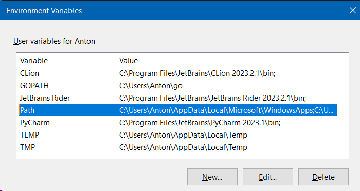
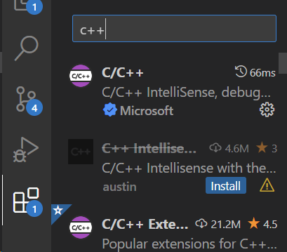

> Обязательно прочитайте [урок по командной строке](../03_command_line).

## Компилятор C++ на высоком уровне

Вкратце:
- Пишите текстовые файлы (исходные файлы с кодом).
- Запускаете программу-компилятор, которая читает эти файлы и производит исполняемый файл.
- Запускаете исполняемый файл (например, через консоль).

> Исполняемые файлы содержат машинный код, то есть инструкции, 
> как описано в [первом уроке](../01_computer_architecture/).

**Для лучшего понимания:**.

Почитайте [этот блогпост](https://www.scaler.com/topics/c/compilation-process-in-c/), там, на мой взгляд, довольно хорошие формулировки.

Для общего понимания можно также посмотреть [это видео](https://www.youtube.com/watch?v=QXjU9qTsYCc).

## Установка компилятора

При выборе компилятора (на Windows) есть несколько вариантов:
- Установить Visual Studio, которая устанавливает компилятор MSVC.
- Установить GCC через MinGW или аналогичную программу.
- Установить Zig, который имеет компилятор C++.

Наиболее простым вариантом является установка Zig.
Достаточно распаковать исполняемый архив, и он просто работает.

### Установка Zig

1. Перейдите на страницу [Zig installation page](https://ziglang.org/download/)
2. Скачайте архив для вашей архитектуры (вероятно, файл типа zig-windows-x86_64-blah-blah.zip).
3. Распакуйте архив куда-нибудь, я рекомендую просто поместить содержимое в папку `D:\zig` или что-то
   подобное.
4. Теперь вы можете вызвать компилятор через командную строку, набрав полный путь к программе
   компилятора например, `D:\zig\zig.exe`.

### Добавление Zig в PATH

Для большего удобства я рекомендую добавить папку в переменную среды PATH,
чтобы иметь возможность вызывать компилятор, просто набрав `zig`.

Для этого (в Windows 10):
- Откройте меню Пуск (нажав клавишу Windows).
- Введите `Edit environ` и выберите опцию `Edit environment variables for your account`.
- Найдите переменную `Path` и щелкните по ней:
    
- Нажмите `Редактировать` для редактирования переменной
- Нажмите `New` и введите путь, по которому вы распаковали Zig, например, `D:\zig`.


## Запуск компилятора

Zig - это компилятор для языка программирования Zig, но мы можем использовать его для компиляции C++.
Это работает потому, что Zig включает в себя компилятор C++.

Чтобы запустить компилятор, достаточно набрать `zig` (или полный путь к `zig.exe`)
в командной строке, после чего указать аргументы, которые необходимо передать компилятору.

Для вызова компилятора C++ необходимо передать Zig аргумент `c++`.
И далее нужно передать ему путь к исходному файлу, который требуется скомпилировать.

Например, если мы находимся в той же папке, что и файл `main.cpp`, то мы можем скомпилировать его следующим образом:
```
zig c++ main.cpp
```

В результате будет создан исполняемый файл с именем `a.exe`, который мы можем запустить следующим образом:
```
.\a
```

При первом запуске компилятора потребуется некоторое время для кэширования некоторых вещей,
но последующие запуски будут происходить быстрее.


### Включение функции "предупреждения как ошибки"

Чтобы воспринимать предупреждения как ошибки, можно передать компилятору аргументы `-Wall` и `-Werror`.

```
zig c++ main.cpp -Wall -Werror
```

Я рекомендую вам сделать это, особенно если вы новичок,
потому что это, скорее всего, спасет вас от нескольких часов битья головой о стену.


### Указание выходного файла

По умолчанию выходной исполняемый файл имеет имя `a.exe`, но вы можете изменить его следующим образом:
```
zig c++ main.cpp -o my_program.exe
```

В результате вместо `a.exe` будет создан исполняемый файл с именем `my_program.exe`.


## Настройка среды разработки

Вы можете программировать в любой IDE или текстовом редакторе,
но я рекомендую использовать Visual Studio Code.
Это потому, что она бесплатна, и я знаю, как ее настраивать.
Впрочем, вы можете использовать любую другую, но не ожидайте, что я 
что я смогу помочь вам, например, с Visual Studio.

### Настройка Visual Studio Code

- Установите Visual Studio Code (come on, с этим вы и сами справитесь).
- На вкладке "Расширения" в Visual Studio Code найдите C++ и установите первое расширение.
  
- Скопируйте-вставьте папку `.vscode` из этого репозитория в папку вашего проекта.
  Это позволит компилировать + запускать открытый в данный момент файл по нажатию клавиши `F5`.

Скопированная конфигурация (`.vscode`) содержит два файла:
- `launch.json` определяет конфигурацию, позволяющую IDE запустить заданный скомпилированный файл.
- `tasks.json` определяет задачу с командой, которая компилирует текущий файл.

Конфигурация в `launch.json` имеет строку `"preLaunchTask": "Zig C++ build current file"`,
которая заставляет выполнить задачу `Zig C++ build current file` перед запуском программы. 
Именно эта задача определена в файле `tasks.json`,
которая просто запускает компилятор zig на текущем файле.

> Вы можете просто изменить используемый компилятор с `zig c++` на, например. 
> `gcc`, если вы его используете, но тогда вам также
> вероятно, придется изменить конфигурацию запуска, чтобы использовать отладчик `gbd`,
> так что здесь вы будете предоставлены сами себе.