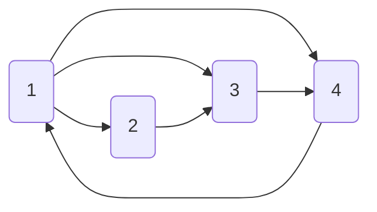
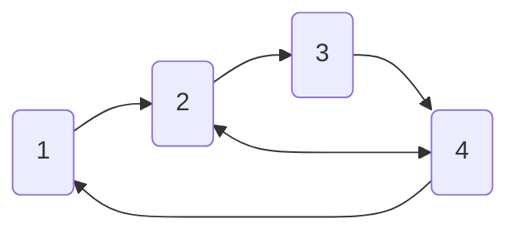

# Лабораторная работа 4

## Графы (Graphs) как структура данных

Используйте идею связных списков, чтобы реализовать графы.
Графы -- это списки, где каждый нод может иметь несколько соседних нодов.

Пример графа есть [здесь](../../en/09_generic_data_structures/graph.cpp).

1. Определите структуру нода из графа. 
   Она должны иметь поле `int` для значения нода, а также динамический буфер для соседних нодов.
   Можете использовать код из [static_buffer](../../en/09_generic_data_structures/static_buffer.cpp)
   или [dynamic_array](../../en/09_generic_data_structures/dynamic_array.cpp).
   > Можете использовать `std::vector`, но тогда убедитесь, что понимаете RAII. 

2. Выполните одну из конфигураций графа:

3. В направленных графах, нод `A` может быть соседом для нода `B`,
   при том что нод `B` на обязательно является соседом нода `A`.
   Для ненаправленных графов, ноды `A` и `B` всегда являются соседями друг друга.
   Объясните как эта идея отобразится в том, как граф будет выглядеть в памяти.

4. Напишите функцию, которая считает сумму значений соседних нодов заданного нода.

5. Выполните алгоритмы прохода DFS и BFS. Можете добавить дополнительную информацию в сами ноды.
