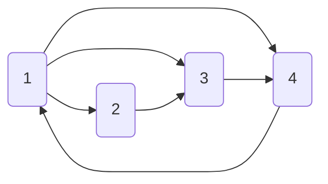
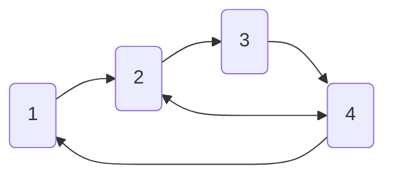

# Лаборатоная работа 5 для ПЕРВОГО КУРСА!

## 1. Linked lists (связные списки)

Распишите код для следующих структур данных.

> Можете выделять память динамически в heap используя `new` или `malloc`, отдельно для каждого нода.
> Можете пользоваться [примерами](../../en/09_generic_data_structures).

1. Singly linked list (односвязный список):
    - Структура должна иметь поля под указатели на первый и последний нод списка;

    - `Node* insertAfter(LinkedList* list, Node* node, int value)` создает новый нод
      и добавляет его после данного нода.
      В случае если `node == nullptr`, нод добавляется в начало списка.
      Возвращает указатель на созданный нод;

    - `FindNodeResult find(LinkedList* list, int value)` ищет нод до нода с заданным значением в списке;
      Возвращает нод с этим значением, а также нод до него.
      `FindNodeResult` определите сами;

    - `void removeAfter(LinkedList* list, Node* node)` удаляет нод следующий данному ноду из списка.
      В случае если `node == nullptr`, удаляется первый нод списка;

    - `void assertNoCycles(LinkedList* list)`, который проверяет, чтобы в списке не было циклов.
      Используйте эту функцию для проверки логики, можете делать `assert` в других функциях что это
      условие выполняется (называется `contract`).

2. Doubly linked list (двусвязный список):
    - Структура должна иметь поля под указатели на первый и последний нод списка;

    - `Node* insertAfter(LinkedList* list, Node* node, int value)`;

    - `Node* insertBefore(LinkedList* list, Node* node, int value)`;

    - `Node* find(LinkedList* list, int value)` ищет нод с данным значением в списке;

    - `void remove(Node* node)` удаляет нод из списка;

    - `void assertNoCycles(LinkedList* list)`.

3. Queue (очередь):
    - Структура должна иметь поля под указатели на первый и последний нод списка;
    
    - `void enqueue(Queue* queue, int value)` добавляет элемент в конец очереди;

    - `int dequeue(Queue* queue)` удаляет элемент из начала очереди и возвращает его;

    - `int isEmpty(Queue* queue)` возвращает `true` если очередь пуста, иначе `false`.

Распишите функции теста для каждой из функций, вызывайте их в `main`.

## 2. Graphs (графы) как структура данных

Используйте идею связных списков, чтобы реализовать графы.
Графы -- это списки, где каждый нод может иметь несколько соседних нодов.

1. Определите структуру нода из графа. 
   Она должны иметь поле `int` для значения нода, а также динамический буфер для соседних нодов.
   Можете использовать код из [static_buffer](../../en/09_generic_data_structures/static_buffer.cpp)
   или [dynamic_buffer](../../en/09_generic_data_structures/dynamic_buffer.cpp)
   или DynamicArray, который вы сделали на 4 лабе.
   > Можете использовать `std::vector`, но тогда убедитесь, что понимаете RAII. 

2. Выполните одну из конфигураций графа:

3. В направленных графах, нод `A` может быть соседом для нода `B`,
   при том что нод `B` на обязательно является соседом нода `A`.
   Для ненаправленных графов, ноды `A` и `B` всегда являются соседями друг друга.
   Объясните как эта идея отобразится в том, как граф будет выглядеть в памяти.

4. Напишите функцию, которая считает сумму значений соседних нодов заданного нода.